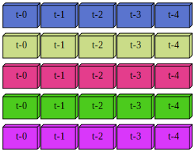

## Array Visualiser
Graphviz based python script to visualise arrays as 3d blocks of data

## Imports and global constants


```python
import graphviz as G
import random

FORWARDS = True   # to visualise array from left to right
BACKWARDS = False # to visualise array from right to left
```

## Layer numbers corresponding to the number of rows of array data (must be contiguous)


```python
layer_num = [1, 2, 3, 4, 5] # row numbers
cells = [5, 5, 5, 5, 5]     # number of data fields in each row i.e., columns in each row

diff = [x - layer_num[i] for i, x in enumerate(layer_num[1:])]
assert diff == [1]*(len(layer_num) - 1), '"layer_num" should contain contiguous numbers only'
assert len(layer_num) == len(cells), "'cells' list and 'layer_num' list should contain same number of entries"

direction = FORWARDS        # control the direction  
include_zero = True         # for time series based data

start = 0 if include_zero else 1

r = lambda: random.randint(0,255)  # to generate random colors for each row 

dot = G.Graph(comment='Matrix', 
              graph_attr={'nodesep':'0.02', 'ranksep':'0.02', 'bgcolor':'transparent'},
              node_attr={'shape':'box3d'})

for l in layer_num:
    if l != 1:
        dot.edge(str(l-1)+str(start), str(l)+str(start), style='invis') # invisible edges to contrain layout
    with dot.subgraph() as sg:
        sg.attr(rank='same')
        color = '#{:02x}{:02x}{:02x}'.format(r(),r(),r())
        for c in range(start, cells[l-1]+start):
            if direction:
                sg.node(str(l)+str(c), 't-'+str(c), style='filled', fillcolor=color)
            else:
                if start == 0:
                    sg.node(str(l)+str(c), 't-'+str(cells[l-1]-c-1), style='filled', fillcolor=color)
                else:
                    sg.node(str(l)+str(c), 't-'+str(cells[l-1]-c), style='filled', fillcolor=color)                    
```

## Render


```python
dot
```





## Save/Export


```python
# dot.format = 'jpeg' # or PDF, SVG, JPEG, PNG, etc. 
```


```python
# to save the file, pdf is default
dot.render('./input_array')
```
